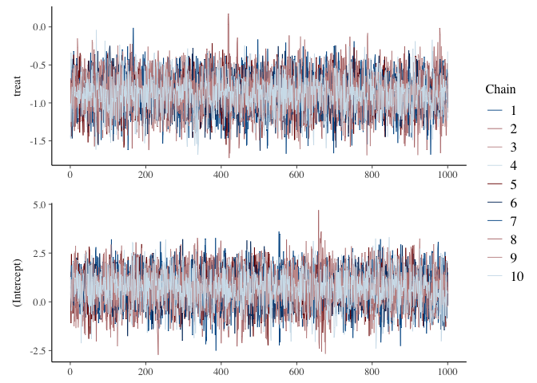

survival_ttr
================
2023-11-10

R code chunk like this:

``` r
data<-cgd0
cgd0[1:4,]
```

    ##   id center random treat sex age height weight inherit steroids propylac
    ## 1  1    204  82888     1   2  12    147   62.0       2        2        2
    ## 2  2    204  82888     0   1  15    159   47.5       2        2        1
    ## 3  3    204  82988     1   1  19    171   72.7       1        2        1
    ## 4  4    204  91388     1   1  12    142   34.0       1        2        1
    ##   hos.cat futime etime1 etime2 etime3 etime4 etime5 etime6 etime7
    ## 1       2    414    219    373     NA     NA     NA     NA     NA
    ## 2       2    439      8     26    152    241    249    322    350
    ## 3       2    382     NA     NA     NA     NA     NA     NA     NA
    ## 4       2    388     NA     NA     NA     NA     NA     NA     NA

# Building time-dependent sets with tmerge

``` r
data2<-tmerge(
  cgd0[, 1:13],
  cgd0,
  id = id,
  tstop = futime,
  infect = event(etime1),
  infect = event(etime2),
  infect = event(etime3),
  infect = event(etime4),
  infect = event(etime5),
  infect = event(etime6),
  infect = event(etime7)
)

data2 <- tmerge(data2, data2, id= id, enum = cumtdc(tstart))
```

## Including Plots

You can also embed plots, for example:

``` r
f.null<-formula(Surv(tstart, tstop, infect) ~ 1.0)
f.full<-formula(Surv(tstart, tstop, infect) ~ treat + inherit + steroids)
```

    ## Call:
    ## coxph(formula = f.full, data = data2, cluster = id)
    ## 
    ##   n= 203, number of events= 76 
    ## 
    ##             coef exp(coef) se(coef) robust se      z Pr(>|z|)    
    ## treat    -1.0722    0.3422   0.2619    0.3118 -3.438 0.000585 ***
    ## inherit   0.1777    1.1944   0.2356    0.3180  0.559 0.576395    
    ## steroids -0.7726    0.4618   0.5169    0.4687 -1.648 0.099310 .  
    ## ---
    ## Signif. codes:  0 '***' 0.001 '**' 0.01 '*' 0.05 '.' 0.1 ' ' 1
    ## 
    ##          exp(coef) exp(-coef) lower .95 upper .95
    ## treat       0.3422     2.9219    0.1857    0.6306
    ## inherit     1.1944     0.8372    0.6404    2.2278
    ## steroids    0.4618     2.1653    0.1843    1.1573
    ## 
    ## Concordance= 0.652  (se = 0.04 )
    ## Likelihood ratio test= 22.49  on 3 df,   p=5e-05
    ## Wald test            = 16.81  on 3 df,   p=8e-04
    ## Score (logrank) test = 22.7  on 3 df,   p=5e-05,   Robust = 10.44  p=0.02
    ## 
    ##   (Note: the likelihood ratio and score tests assume independence of
    ##      observations within a cluster, the Wald and robust score tests do not).

    ##            df      AIC
    ## m.cox.null  0 684.2894
    ## m.cox.full  3 667.7961

# Bayes version

We start with no prior knowledge (default):

``` r
# when chains>1 r makes use of viewer
CHAINS <- 10
CORES <- 10
ITER <- 2000
SEED <- 42
# draw from the prior predictive distribution of the stan_surv survival model
prior.stan.cgd <- stan_surv(
  formula = f.full,
  data = data2,
  basehaz = "exp",
  prior_PD = TRUE,
  chains = CHAINS,
  cores = CORES,
  iter = ITER,refresh=2000,
  seed = SEED)
```

Let’s use more appropriate priors\*

``` r
prior.stan.cgd2 <- update(prior.stan.cgd,
                            prior_intercept = normal(0, 1),
                            prior = normal(0, .5))
print(prior.stan.cgd2, digits = 3)
```

    ## stan_surv
    ##  baseline hazard: exponential
    ##  formula:         Surv(tstart, tstop, infect) ~ treat + inherit + steroids
    ##  observations:    203
    ##  events:          76 (37.4%)
    ##  right censored:  127 (62.6%)
    ##  delayed entry:   yes
    ## ------
    ##             Median MAD_SD exp(Median)
    ## (Intercept) -6.219  1.653     NA     
    ## treat        0.004  0.501  1.004     
    ## inherit     -0.002  0.492  0.998     
    ## steroids     0.004  0.518  1.004     
    ## 
    ## ------
    ## * For help interpreting the printed output see ?print.stanreg
    ## * For info on the priors used see ?prior_summary.stanreg

``` r
#Compare them
mcmc_intervals(prior.stan.cgd)
```

<!-- -->

``` r
mcmc_intervals(prior.stan.cgd2)
```

<!-- -->

## Sampling exp+mspline

``` r
# Null
fit.stan.cgd.exp.f.null <- update(prior.stan.cgd2,  
                             prior_PD = FALSE,
                             formula=f.null,
                             basehaz = "exp")
# cubic m-spline tstart2, tstop2
fit.stan.cgd.ms10.f.null <- update(fit.stan.cgd.exp.f.null,
                        basehaz = "ms",
                        basehaz_ops = list(df = 10))
# Full
fit.stan.cgd.exp.f.full <- update(prior.stan.cgd2,  
                             prior_PD = FALSE,
                             formula=f.full,
                             basehaz = "exp")
# cubic m-spline tstart2, tstop2
fit.stan.cgd.ms10.f.full <- update(fit.stan.cgd.exp.f.full,
                        basehaz = "ms",
                        basehaz_ops = list(df = 10))

fits_stan <- list("exp.f.null" = fit.stan.cgd.exp.f.null,
                  "exp.f.full" = fit.stan.cgd.exp.f.full,
                  "ms10.f.null" = fit.stan.cgd.ms10.f.null,
                  "ms10.f.full" = fit.stan.cgd.ms10.f.full

                  )
# fit.stan.as.ms10<-fit.stan.ms10
print(fit.stan.cgd.exp.f.full, digits = 3)
```

    ## stan_surv
    ##  baseline hazard: exponential
    ##  formula:         Surv(tstart, tstop, infect) ~ treat + inherit + steroids
    ##  observations:    203
    ##  events:          76 (37.4%)
    ##  right censored:  127 (62.6%)
    ##  delayed entry:   yes
    ## ------
    ##             Median MAD_SD exp(Median)
    ## (Intercept) -5.527  0.815     NA     
    ## treat       -0.825  0.225  0.438     
    ## inherit      0.164  0.214  1.178     
    ## steroids    -0.296  0.384  0.744     
    ## 
    ## ------
    ## * For help interpreting the printed output see ?print.stanreg
    ## * For info on the priors used see ?prior_summary.stanreg

``` r
print(fit.stan.cgd.ms10.f.full, digits = 3)
```

    ## stan_surv
    ##  baseline hazard: M-splines on hazard scale
    ##  formula:         Surv(tstart, tstop, infect) ~ treat + inherit + steroids
    ##  observations:    203
    ##  events:          76 (37.4%)
    ##  right censored:  127 (62.6%)
    ##  delayed entry:   yes
    ## ------
    ##                  Median MAD_SD exp(Median)
    ## (Intercept)       0.682  0.868     NA     
    ## treat            -0.874  0.232  0.417     
    ## inherit           0.169  0.217  1.185     
    ## steroids         -0.318  0.403  0.728     
    ## m-splines-coef1   0.051  0.026     NA     
    ## m-splines-coef2   0.032  0.029     NA     
    ## m-splines-coef3   0.035  0.029     NA     
    ## m-splines-coef4   0.086  0.044     NA     
    ## m-splines-coef5   0.077  0.046     NA     
    ## m-splines-coef6   0.068  0.047     NA     
    ## m-splines-coef7   0.262  0.079     NA     
    ## m-splines-coef8   0.132  0.100     NA     
    ## m-splines-coef9   0.130  0.103     NA     
    ## m-splines-coef10  0.052  0.052     NA     
    ## 
    ## ------
    ## * For help interpreting the printed output see ?print.stanreg
    ## * For info on the priors used see ?prior_summary.stanreg

``` r
#Are chains mixing well?
color_scheme_set("mix-blue-red")
mcmc_trace(fit.stan.cgd.ms10.f.full, 
           pars=c("treat", "(Intercept)"),
           facet_args = list(ncol = 1, strip.position = "left")
           )
```

<!-- -->

## Posterior uncertainty intervals

``` r
m.cox.full%>%
  tbl_regression(exponentiate = TRUE)
```

<div id="qakzshlqsm" style="padding-left:0px;padding-right:0px;padding-top:10px;padding-bottom:10px;overflow-x:auto;overflow-y:auto;width:auto;height:auto;">
<style>#qakzshlqsm table {
  font-family: system-ui, 'Segoe UI', Roboto, Helvetica, Arial, sans-serif, 'Apple Color Emoji', 'Segoe UI Emoji', 'Segoe UI Symbol', 'Noto Color Emoji';
  -webkit-font-smoothing: antialiased;
  -moz-osx-font-smoothing: grayscale;
}
&#10;#qakzshlqsm thead, #qakzshlqsm tbody, #qakzshlqsm tfoot, #qakzshlqsm tr, #qakzshlqsm td, #qakzshlqsm th {
  border-style: none;
}
&#10;#qakzshlqsm p {
  margin: 0;
  padding: 0;
}
&#10;#qakzshlqsm .gt_table {
  display: table;
  border-collapse: collapse;
  line-height: normal;
  margin-left: auto;
  margin-right: auto;
  color: #333333;
  font-size: 16px;
  font-weight: normal;
  font-style: normal;
  background-color: #FFFFFF;
  width: auto;
  border-top-style: solid;
  border-top-width: 2px;
  border-top-color: #A8A8A8;
  border-right-style: none;
  border-right-width: 2px;
  border-right-color: #D3D3D3;
  border-bottom-style: solid;
  border-bottom-width: 2px;
  border-bottom-color: #A8A8A8;
  border-left-style: none;
  border-left-width: 2px;
  border-left-color: #D3D3D3;
}
&#10;#qakzshlqsm .gt_caption {
  padding-top: 4px;
  padding-bottom: 4px;
}
&#10;#qakzshlqsm .gt_title {
  color: #333333;
  font-size: 125%;
  font-weight: initial;
  padding-top: 4px;
  padding-bottom: 4px;
  padding-left: 5px;
  padding-right: 5px;
  border-bottom-color: #FFFFFF;
  border-bottom-width: 0;
}
&#10;#qakzshlqsm .gt_subtitle {
  color: #333333;
  font-size: 85%;
  font-weight: initial;
  padding-top: 3px;
  padding-bottom: 5px;
  padding-left: 5px;
  padding-right: 5px;
  border-top-color: #FFFFFF;
  border-top-width: 0;
}
&#10;#qakzshlqsm .gt_heading {
  background-color: #FFFFFF;
  text-align: center;
  border-bottom-color: #FFFFFF;
  border-left-style: none;
  border-left-width: 1px;
  border-left-color: #D3D3D3;
  border-right-style: none;
  border-right-width: 1px;
  border-right-color: #D3D3D3;
}
&#10;#qakzshlqsm .gt_bottom_border {
  border-bottom-style: solid;
  border-bottom-width: 2px;
  border-bottom-color: #D3D3D3;
}
&#10;#qakzshlqsm .gt_col_headings {
  border-top-style: solid;
  border-top-width: 2px;
  border-top-color: #D3D3D3;
  border-bottom-style: solid;
  border-bottom-width: 2px;
  border-bottom-color: #D3D3D3;
  border-left-style: none;
  border-left-width: 1px;
  border-left-color: #D3D3D3;
  border-right-style: none;
  border-right-width: 1px;
  border-right-color: #D3D3D3;
}
&#10;#qakzshlqsm .gt_col_heading {
  color: #333333;
  background-color: #FFFFFF;
  font-size: 100%;
  font-weight: normal;
  text-transform: inherit;
  border-left-style: none;
  border-left-width: 1px;
  border-left-color: #D3D3D3;
  border-right-style: none;
  border-right-width: 1px;
  border-right-color: #D3D3D3;
  vertical-align: bottom;
  padding-top: 5px;
  padding-bottom: 6px;
  padding-left: 5px;
  padding-right: 5px;
  overflow-x: hidden;
}
&#10;#qakzshlqsm .gt_column_spanner_outer {
  color: #333333;
  background-color: #FFFFFF;
  font-size: 100%;
  font-weight: normal;
  text-transform: inherit;
  padding-top: 0;
  padding-bottom: 0;
  padding-left: 4px;
  padding-right: 4px;
}
&#10;#qakzshlqsm .gt_column_spanner_outer:first-child {
  padding-left: 0;
}
&#10;#qakzshlqsm .gt_column_spanner_outer:last-child {
  padding-right: 0;
}
&#10;#qakzshlqsm .gt_column_spanner {
  border-bottom-style: solid;
  border-bottom-width: 2px;
  border-bottom-color: #D3D3D3;
  vertical-align: bottom;
  padding-top: 5px;
  padding-bottom: 5px;
  overflow-x: hidden;
  display: inline-block;
  width: 100%;
}
&#10;#qakzshlqsm .gt_spanner_row {
  border-bottom-style: hidden;
}
&#10;#qakzshlqsm .gt_group_heading {
  padding-top: 8px;
  padding-bottom: 8px;
  padding-left: 5px;
  padding-right: 5px;
  color: #333333;
  background-color: #FFFFFF;
  font-size: 100%;
  font-weight: initial;
  text-transform: inherit;
  border-top-style: solid;
  border-top-width: 2px;
  border-top-color: #D3D3D3;
  border-bottom-style: solid;
  border-bottom-width: 2px;
  border-bottom-color: #D3D3D3;
  border-left-style: none;
  border-left-width: 1px;
  border-left-color: #D3D3D3;
  border-right-style: none;
  border-right-width: 1px;
  border-right-color: #D3D3D3;
  vertical-align: middle;
  text-align: left;
}
&#10;#qakzshlqsm .gt_empty_group_heading {
  padding: 0.5px;
  color: #333333;
  background-color: #FFFFFF;
  font-size: 100%;
  font-weight: initial;
  border-top-style: solid;
  border-top-width: 2px;
  border-top-color: #D3D3D3;
  border-bottom-style: solid;
  border-bottom-width: 2px;
  border-bottom-color: #D3D3D3;
  vertical-align: middle;
}
&#10;#qakzshlqsm .gt_from_md > :first-child {
  margin-top: 0;
}
&#10;#qakzshlqsm .gt_from_md > :last-child {
  margin-bottom: 0;
}
&#10;#qakzshlqsm .gt_row {
  padding-top: 8px;
  padding-bottom: 8px;
  padding-left: 5px;
  padding-right: 5px;
  margin: 10px;
  border-top-style: solid;
  border-top-width: 1px;
  border-top-color: #D3D3D3;
  border-left-style: none;
  border-left-width: 1px;
  border-left-color: #D3D3D3;
  border-right-style: none;
  border-right-width: 1px;
  border-right-color: #D3D3D3;
  vertical-align: middle;
  overflow-x: hidden;
}
&#10;#qakzshlqsm .gt_stub {
  color: #333333;
  background-color: #FFFFFF;
  font-size: 100%;
  font-weight: initial;
  text-transform: inherit;
  border-right-style: solid;
  border-right-width: 2px;
  border-right-color: #D3D3D3;
  padding-left: 5px;
  padding-right: 5px;
}
&#10;#qakzshlqsm .gt_stub_row_group {
  color: #333333;
  background-color: #FFFFFF;
  font-size: 100%;
  font-weight: initial;
  text-transform: inherit;
  border-right-style: solid;
  border-right-width: 2px;
  border-right-color: #D3D3D3;
  padding-left: 5px;
  padding-right: 5px;
  vertical-align: top;
}
&#10;#qakzshlqsm .gt_row_group_first td {
  border-top-width: 2px;
}
&#10;#qakzshlqsm .gt_row_group_first th {
  border-top-width: 2px;
}
&#10;#qakzshlqsm .gt_summary_row {
  color: #333333;
  background-color: #FFFFFF;
  text-transform: inherit;
  padding-top: 8px;
  padding-bottom: 8px;
  padding-left: 5px;
  padding-right: 5px;
}
&#10;#qakzshlqsm .gt_first_summary_row {
  border-top-style: solid;
  border-top-color: #D3D3D3;
}
&#10;#qakzshlqsm .gt_first_summary_row.thick {
  border-top-width: 2px;
}
&#10;#qakzshlqsm .gt_last_summary_row {
  padding-top: 8px;
  padding-bottom: 8px;
  padding-left: 5px;
  padding-right: 5px;
  border-bottom-style: solid;
  border-bottom-width: 2px;
  border-bottom-color: #D3D3D3;
}
&#10;#qakzshlqsm .gt_grand_summary_row {
  color: #333333;
  background-color: #FFFFFF;
  text-transform: inherit;
  padding-top: 8px;
  padding-bottom: 8px;
  padding-left: 5px;
  padding-right: 5px;
}
&#10;#qakzshlqsm .gt_first_grand_summary_row {
  padding-top: 8px;
  padding-bottom: 8px;
  padding-left: 5px;
  padding-right: 5px;
  border-top-style: double;
  border-top-width: 6px;
  border-top-color: #D3D3D3;
}
&#10;#qakzshlqsm .gt_last_grand_summary_row_top {
  padding-top: 8px;
  padding-bottom: 8px;
  padding-left: 5px;
  padding-right: 5px;
  border-bottom-style: double;
  border-bottom-width: 6px;
  border-bottom-color: #D3D3D3;
}
&#10;#qakzshlqsm .gt_striped {
  background-color: rgba(128, 128, 128, 0.05);
}
&#10;#qakzshlqsm .gt_table_body {
  border-top-style: solid;
  border-top-width: 2px;
  border-top-color: #D3D3D3;
  border-bottom-style: solid;
  border-bottom-width: 2px;
  border-bottom-color: #D3D3D3;
}
&#10;#qakzshlqsm .gt_footnotes {
  color: #333333;
  background-color: #FFFFFF;
  border-bottom-style: none;
  border-bottom-width: 2px;
  border-bottom-color: #D3D3D3;
  border-left-style: none;
  border-left-width: 2px;
  border-left-color: #D3D3D3;
  border-right-style: none;
  border-right-width: 2px;
  border-right-color: #D3D3D3;
}
&#10;#qakzshlqsm .gt_footnote {
  margin: 0px;
  font-size: 90%;
  padding-top: 4px;
  padding-bottom: 4px;
  padding-left: 5px;
  padding-right: 5px;
}
&#10;#qakzshlqsm .gt_sourcenotes {
  color: #333333;
  background-color: #FFFFFF;
  border-bottom-style: none;
  border-bottom-width: 2px;
  border-bottom-color: #D3D3D3;
  border-left-style: none;
  border-left-width: 2px;
  border-left-color: #D3D3D3;
  border-right-style: none;
  border-right-width: 2px;
  border-right-color: #D3D3D3;
}
&#10;#qakzshlqsm .gt_sourcenote {
  font-size: 90%;
  padding-top: 4px;
  padding-bottom: 4px;
  padding-left: 5px;
  padding-right: 5px;
}
&#10;#qakzshlqsm .gt_left {
  text-align: left;
}
&#10;#qakzshlqsm .gt_center {
  text-align: center;
}
&#10;#qakzshlqsm .gt_right {
  text-align: right;
  font-variant-numeric: tabular-nums;
}
&#10;#qakzshlqsm .gt_font_normal {
  font-weight: normal;
}
&#10;#qakzshlqsm .gt_font_bold {
  font-weight: bold;
}
&#10;#qakzshlqsm .gt_font_italic {
  font-style: italic;
}
&#10;#qakzshlqsm .gt_super {
  font-size: 65%;
}
&#10;#qakzshlqsm .gt_footnote_marks {
  font-size: 75%;
  vertical-align: 0.4em;
  position: initial;
}
&#10;#qakzshlqsm .gt_asterisk {
  font-size: 100%;
  vertical-align: 0;
}
&#10;#qakzshlqsm .gt_indent_1 {
  text-indent: 5px;
}
&#10;#qakzshlqsm .gt_indent_2 {
  text-indent: 10px;
}
&#10;#qakzshlqsm .gt_indent_3 {
  text-indent: 15px;
}
&#10;#qakzshlqsm .gt_indent_4 {
  text-indent: 20px;
}
&#10;#qakzshlqsm .gt_indent_5 {
  text-indent: 25px;
}
</style>
<table class="gt_table" data-quarto-disable-processing="false" data-quarto-bootstrap="false">
  <thead>
    &#10;    <tr class="gt_col_headings">
      <th class="gt_col_heading gt_columns_bottom_border gt_left" rowspan="1" colspan="1" scope="col" id="&lt;strong&gt;Characteristic&lt;/strong&gt;"><strong>Characteristic</strong></th>
      <th class="gt_col_heading gt_columns_bottom_border gt_center" rowspan="1" colspan="1" scope="col" id="&lt;strong&gt;HR&lt;/strong&gt;&lt;span class=&quot;gt_footnote_marks&quot; style=&quot;white-space:nowrap;font-style:italic;font-weight:normal;&quot;&gt;&lt;sup&gt;1&lt;/sup&gt;&lt;/span&gt;"><strong>HR</strong><span class="gt_footnote_marks" style="white-space:nowrap;font-style:italic;font-weight:normal;"><sup>1</sup></span></th>
      <th class="gt_col_heading gt_columns_bottom_border gt_center" rowspan="1" colspan="1" scope="col" id="&lt;strong&gt;95% CI&lt;/strong&gt;&lt;span class=&quot;gt_footnote_marks&quot; style=&quot;white-space:nowrap;font-style:italic;font-weight:normal;&quot;&gt;&lt;sup&gt;1&lt;/sup&gt;&lt;/span&gt;"><strong>95% CI</strong><span class="gt_footnote_marks" style="white-space:nowrap;font-style:italic;font-weight:normal;"><sup>1</sup></span></th>
      <th class="gt_col_heading gt_columns_bottom_border gt_center" rowspan="1" colspan="1" scope="col" id="&lt;strong&gt;p-value&lt;/strong&gt;"><strong>p-value</strong></th>
    </tr>
  </thead>
  <tbody class="gt_table_body">
    <tr><td headers="label" class="gt_row gt_left">treat</td>
<td headers="estimate" class="gt_row gt_center">0.34</td>
<td headers="ci" class="gt_row gt_center">0.19, 0.63</td>
<td headers="p.value" class="gt_row gt_center"><0.001</td></tr>
    <tr><td headers="label" class="gt_row gt_left">inherit</td>
<td headers="estimate" class="gt_row gt_center">1.19</td>
<td headers="ci" class="gt_row gt_center">0.64, 2.23</td>
<td headers="p.value" class="gt_row gt_center">0.6</td></tr>
    <tr><td headers="label" class="gt_row gt_left">steroids</td>
<td headers="estimate" class="gt_row gt_center">0.46</td>
<td headers="ci" class="gt_row gt_center">0.18, 1.16</td>
<td headers="p.value" class="gt_row gt_center">0.10</td></tr>
  </tbody>
  &#10;  <tfoot class="gt_footnotes">
    <tr>
      <td class="gt_footnote" colspan="4"><span class="gt_footnote_marks" style="white-space:nowrap;font-style:italic;font-weight:normal;"><sup>1</sup></span> HR = Hazard Ratio, CI = Confidence Interval</td>
    </tr>
  </tfoot>
</table>
</div>

``` r
mcmc_post_ci(fit.stan.cgd.exp.f.full,.95,4)
```

    ##                           HR
    ## treat    0.44 (0.28 to 0.67)
    ## inherit  1.18 (0.78 to 1.79)
    ## steroids 0.74 (0.36 to 1.63)

``` r
mcmc_post_ci(fit.stan.cgd.ms10.f.full,.95,4)
```

    ##                           HR
    ## treat    0.42 (0.26 to 0.65)
    ## inherit  1.18 (0.76 to 1.81)
    ## steroids 0.73 (0.34 to 1.68)

## Hazard baseline

``` r
plots <- map(fits_stan,plot)

a<-plots[[2]]+
  labs(title = "Constant (exp)")+
  coord_cartesian(ylim = c(0,.1))+
  theme(plot.title = element_text(hjust = .5))

b<-plots[[4]]+labs(title = "M-splines  (df=10)")+
  coord_cartesian(ylim = c(0,.1))+
  theme(plot.title = element_text(hjust = .5))
a+b
```

<!-- -->
