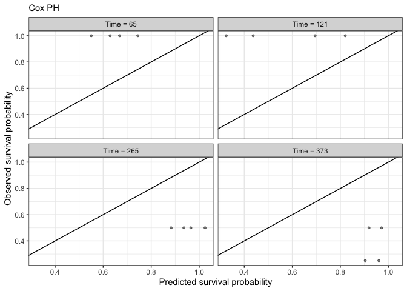

Bayesian Workflow for Survival Analysis of Recurrent Events
================
2023-11-10

# 1 Introduction

Tutorials in survival models for recurrent events are scarce with
limited content on the whole workflow using Bayesian inference in R.
Hence, I developed a Bayesian workflow for survival analysis, covering
model specification, priors, visualization, validation and even
deployment in Shiny.

This tutorial extends Brilleman et al.,$$1$$ vignettes to recurrent
events scenario. Regression models were developed in R using survival,
rstanarm, and ggplot packages. Bayesian inference used Hamiltonian Monte
Carlo No-U-Turn Sampler (NUTS) with 10 chains, 2000 iterations (50%
warmup, 50% inference) and 10 degrees of freedom $(\delta=10)$ in the
hazard function.

``` r
data<-cgd0
cgd0[1:4,]
```

    ##   id center random treat sex age height weight inherit steroids propylac
    ## 1  1    204  82888     1   2  12    147   62.0       2        2        2
    ## 2  2    204  82888     0   1  15    159   47.5       2        2        1
    ## 3  3    204  82988     1   1  19    171   72.7       1        2        1
    ## 4  4    204  91388     1   1  12    142   34.0       1        2        1
    ##   hos.cat futime etime1 etime2 etime3 etime4 etime5 etime6 etime7
    ## 1       2    414    219    373     NA     NA     NA     NA     NA
    ## 2       2    439      8     26    152    241    249    322    350
    ## 3       2    382     NA     NA     NA     NA     NA     NA     NA
    ## 4       2    388     NA     NA     NA     NA     NA     NA     NA

# 2 Building time-dependent sets with tmerge

Data are from the famous controlled trial in chronic granulotomous
disease (CGD). It contains 203 observations on time to serious
infections observed through end of study for each patient. Recurrent
events and covariates for each patient were encoded as time intervals
between events. $$2$$ For example, patient 1 was followed for 60 days
and had infection events on days 1, 24 and 37, patient 2 had 7 events
and patient 3 had one event on day one, and all patients were censored
on day 439.

``` r
data2<-tmerge(
  cgd0[, 1:13],
  cgd0,
  id = id,
  tstop = futime,
  infect = event(etime1),
  infect = event(etime2),
  infect = event(etime3),
  infect = event(etime4),
  infect = event(etime5),
  infect = event(etime6),
  infect = event(etime7)
)

data2 <- tmerge(data2, data2, id= id, enum = cumtdc(tstart))
```

## 2.1 COX Proportional Hazard

``` r
f.null<-formula(Surv(tstart, tstop, infect) ~ 1.0)
f.full<-formula(Surv(tstart, tstop, infect) ~ treat + inherit + steroids)
```

    ## Call:
    ## coxph(formula = f.full, data = data2, cluster = id)
    ## 
    ##   n= 203, number of events= 76 
    ## 
    ##             coef exp(coef) se(coef) robust se      z Pr(>|z|)    
    ## treat    -1.0722    0.3422   0.2619    0.3118 -3.438 0.000585 ***
    ## inherit   0.1777    1.1944   0.2356    0.3180  0.559 0.576395    
    ## steroids -0.7726    0.4618   0.5169    0.4687 -1.648 0.099310 .  
    ## ---
    ## Signif. codes:  0 '***' 0.001 '**' 0.01 '*' 0.05 '.' 0.1 ' ' 1
    ## 
    ##          exp(coef) exp(-coef) lower .95 upper .95
    ## treat       0.3422     2.9219    0.1857    0.6306
    ## inherit     1.1944     0.8372    0.6404    2.2278
    ## steroids    0.4618     2.1653    0.1843    1.1573
    ## 
    ## Concordance= 0.652  (se = 0.04 )
    ## Likelihood ratio test= 22.49  on 3 df,   p=5e-05
    ## Wald test            = 16.81  on 3 df,   p=8e-04
    ## Score (logrank) test = 22.7  on 3 df,   p=5e-05,   Robust = 10.44  p=0.02
    ## 
    ##   (Note: the likelihood ratio and score tests assume independence of
    ##      observations within a cluster, the Wald and robust score tests do not).

    ##            df      AIC
    ## m.cox.null  0 684.2894
    ## m.cox.full  3 667.7961

# 3 Bayes Inference

Probability for infection event was calculated under a Bayesian survival
analysis framework using a spline-based (M-spline) hazard regression
model. $$2$$ The M-Spline hazard function is defined as: $$
\begin{aligned}
  h(i)=\sum_{l=1}^{L} \gamma_{l}M_{l}(t;k;\delta)exp(\eta_{i}(t))\\
\end{aligned}
$$ Where $h_i(t)$ is the hazard of the event for individual i with
$\eta_{i}$ time-dependent predictors at time $t$. $l^{th} (l=1,…,L)$
denotes the basis term for a degree $\delta$ M-spline function evaluated
at a vector of knot locations $k=\{ k_1,…,k_J \}$ and $\gamma_l$ denotes
the $l^{th}$ M-spline coefficient. For our example, we estimated hazard
ratios (HRs) and survival probability curves between treated and
untreated patients.

We start with no prior knowledge (default):

``` r
# when chains>1 r makes use of viewer
CHAINS <- 10
CORES <- 10
ITER <- 2000
SEED <- 42
# draw from the prior predictive distribution of the stan_surv survival model
prior.stan.cgd <- stan_surv(
  formula = f.full,
  data = data2,
  basehaz = "exp",
  prior_PD = TRUE,
  chains = CHAINS,
  cores = CORES,
  iter = ITER,refresh=2000,
  seed = SEED)
```

Let’s use more appropriate priors:

``` r
prior.stan.cgd2 <- update(prior.stan.cgd,
                            prior_intercept = normal(0, 1),
                            prior = normal(0, .5))
print(prior.stan.cgd2, digits = 3)
```

    ## stan_surv
    ##  baseline hazard: exponential
    ##  formula:         Surv(tstart, tstop, infect) ~ treat + inherit + steroids
    ##  observations:    203
    ##  events:          76 (37.4%)
    ##  right censored:  127 (62.6%)
    ##  delayed entry:   yes
    ## ------
    ##             Median MAD_SD exp(Median)
    ## (Intercept) -6.219  1.653     NA     
    ## treat        0.004  0.501  1.004     
    ## inherit     -0.002  0.492  0.998     
    ## steroids     0.004  0.518  1.004     
    ## 
    ## ------
    ## * For help interpreting the printed output see ?print.stanreg
    ## * For info on the priors used see ?prior_summary.stanreg

``` r
#Compare them
mcmc_intervals(prior.stan.cgd)
```

<!-- -->

``` r
mcmc_intervals(prior.stan.cgd2)
```

<!-- -->

## 3.1 Sampling exp+mspline

``` r
# Null
fit.stan.cgd.exp.f.null <- update(prior.stan.cgd2,  
                             prior_PD = FALSE,
                             formula=f.null,
                             basehaz = "exp")
# cubic m-spline tstart2, tstop2
fit.stan.cgd.ms10.f.null <- update(fit.stan.cgd.exp.f.null,
                        basehaz = "ms",
                        basehaz_ops = list(df = 10))
# Full
fit.stan.cgd.exp.f.full <- update(prior.stan.cgd2,  
                             prior_PD = FALSE,
                             formula=f.full,
                             basehaz = "exp")
fit.stan.cgd.ms10.f.full <- update(fit.stan.cgd.exp.f.full,
                        basehaz = "ms",
                        basehaz_ops = list(df = 10))
fits_stan <- list("exp.f.null" = fit.stan.cgd.exp.f.null,
                  "exp.f.full" = fit.stan.cgd.exp.f.full,
                  "ms10.f.null" = fit.stan.cgd.ms10.f.null,
                  "ms10.f.full" = fit.stan.cgd.ms10.f.full

                  )
print(fit.stan.cgd.exp.f.full, digits = 3)
```

    ## stan_surv
    ##  baseline hazard: exponential
    ##  formula:         Surv(tstart, tstop, infect) ~ treat + inherit + steroids
    ##  observations:    203
    ##  events:          76 (37.4%)
    ##  right censored:  127 (62.6%)
    ##  delayed entry:   yes
    ## ------
    ##             Median MAD_SD exp(Median)
    ## (Intercept) -5.527  0.815     NA     
    ## treat       -0.825  0.225  0.438     
    ## inherit      0.164  0.214  1.178     
    ## steroids    -0.296  0.384  0.744     
    ## 
    ## ------
    ## * For help interpreting the printed output see ?print.stanreg
    ## * For info on the priors used see ?prior_summary.stanreg

``` r
print(fit.stan.cgd.ms10.f.full, digits = 3)
```

    ## stan_surv
    ##  baseline hazard: M-splines on hazard scale
    ##  formula:         Surv(tstart, tstop, infect) ~ treat + inherit + steroids
    ##  observations:    203
    ##  events:          76 (37.4%)
    ##  right censored:  127 (62.6%)
    ##  delayed entry:   yes
    ## ------
    ##                  Median MAD_SD exp(Median)
    ## (Intercept)       0.682  0.868     NA     
    ## treat            -0.874  0.232  0.417     
    ## inherit           0.169  0.217  1.185     
    ## steroids         -0.318  0.403  0.728     
    ## m-splines-coef1   0.051  0.026     NA     
    ## m-splines-coef2   0.032  0.029     NA     
    ## m-splines-coef3   0.035  0.029     NA     
    ## m-splines-coef4   0.086  0.044     NA     
    ## m-splines-coef5   0.077  0.046     NA     
    ## m-splines-coef6   0.068  0.047     NA     
    ## m-splines-coef7   0.262  0.079     NA     
    ## m-splines-coef8   0.132  0.100     NA     
    ## m-splines-coef9   0.130  0.103     NA     
    ## m-splines-coef10  0.052  0.052     NA     
    ## 
    ## ------
    ## * For help interpreting the printed output see ?print.stanreg
    ## * For info on the priors used see ?prior_summary.stanreg

Further information on calculating the hazard curve and the RMST can be
found in $$3-6$$.

## 3.2 Posterior uncertainty intervals

``` r
m.cox.full%>%
  tbl_regression(exponentiate = T)
```

<div id="uiiajyqzoc" style="padding-left:0px;padding-right:0px;padding-top:10px;padding-bottom:10px;overflow-x:auto;overflow-y:auto;width:auto;height:auto;">
<style>#uiiajyqzoc table {
  font-family: system-ui, 'Segoe UI', Roboto, Helvetica, Arial, sans-serif, 'Apple Color Emoji', 'Segoe UI Emoji', 'Segoe UI Symbol', 'Noto Color Emoji';
  -webkit-font-smoothing: antialiased;
  -moz-osx-font-smoothing: grayscale;
}
&#10;#uiiajyqzoc thead, #uiiajyqzoc tbody, #uiiajyqzoc tfoot, #uiiajyqzoc tr, #uiiajyqzoc td, #uiiajyqzoc th {
  border-style: none;
}
&#10;#uiiajyqzoc p {
  margin: 0;
  padding: 0;
}
&#10;#uiiajyqzoc .gt_table {
  display: table;
  border-collapse: collapse;
  line-height: normal;
  margin-left: auto;
  margin-right: auto;
  color: #333333;
  font-size: 16px;
  font-weight: normal;
  font-style: normal;
  background-color: #FFFFFF;
  width: auto;
  border-top-style: solid;
  border-top-width: 2px;
  border-top-color: #A8A8A8;
  border-right-style: none;
  border-right-width: 2px;
  border-right-color: #D3D3D3;
  border-bottom-style: solid;
  border-bottom-width: 2px;
  border-bottom-color: #A8A8A8;
  border-left-style: none;
  border-left-width: 2px;
  border-left-color: #D3D3D3;
}
&#10;#uiiajyqzoc .gt_caption {
  padding-top: 4px;
  padding-bottom: 4px;
}
&#10;#uiiajyqzoc .gt_title {
  color: #333333;
  font-size: 125%;
  font-weight: initial;
  padding-top: 4px;
  padding-bottom: 4px;
  padding-left: 5px;
  padding-right: 5px;
  border-bottom-color: #FFFFFF;
  border-bottom-width: 0;
}
&#10;#uiiajyqzoc .gt_subtitle {
  color: #333333;
  font-size: 85%;
  font-weight: initial;
  padding-top: 3px;
  padding-bottom: 5px;
  padding-left: 5px;
  padding-right: 5px;
  border-top-color: #FFFFFF;
  border-top-width: 0;
}
&#10;#uiiajyqzoc .gt_heading {
  background-color: #FFFFFF;
  text-align: center;
  border-bottom-color: #FFFFFF;
  border-left-style: none;
  border-left-width: 1px;
  border-left-color: #D3D3D3;
  border-right-style: none;
  border-right-width: 1px;
  border-right-color: #D3D3D3;
}
&#10;#uiiajyqzoc .gt_bottom_border {
  border-bottom-style: solid;
  border-bottom-width: 2px;
  border-bottom-color: #D3D3D3;
}
&#10;#uiiajyqzoc .gt_col_headings {
  border-top-style: solid;
  border-top-width: 2px;
  border-top-color: #D3D3D3;
  border-bottom-style: solid;
  border-bottom-width: 2px;
  border-bottom-color: #D3D3D3;
  border-left-style: none;
  border-left-width: 1px;
  border-left-color: #D3D3D3;
  border-right-style: none;
  border-right-width: 1px;
  border-right-color: #D3D3D3;
}
&#10;#uiiajyqzoc .gt_col_heading {
  color: #333333;
  background-color: #FFFFFF;
  font-size: 100%;
  font-weight: normal;
  text-transform: inherit;
  border-left-style: none;
  border-left-width: 1px;
  border-left-color: #D3D3D3;
  border-right-style: none;
  border-right-width: 1px;
  border-right-color: #D3D3D3;
  vertical-align: bottom;
  padding-top: 5px;
  padding-bottom: 6px;
  padding-left: 5px;
  padding-right: 5px;
  overflow-x: hidden;
}
&#10;#uiiajyqzoc .gt_column_spanner_outer {
  color: #333333;
  background-color: #FFFFFF;
  font-size: 100%;
  font-weight: normal;
  text-transform: inherit;
  padding-top: 0;
  padding-bottom: 0;
  padding-left: 4px;
  padding-right: 4px;
}
&#10;#uiiajyqzoc .gt_column_spanner_outer:first-child {
  padding-left: 0;
}
&#10;#uiiajyqzoc .gt_column_spanner_outer:last-child {
  padding-right: 0;
}
&#10;#uiiajyqzoc .gt_column_spanner {
  border-bottom-style: solid;
  border-bottom-width: 2px;
  border-bottom-color: #D3D3D3;
  vertical-align: bottom;
  padding-top: 5px;
  padding-bottom: 5px;
  overflow-x: hidden;
  display: inline-block;
  width: 100%;
}
&#10;#uiiajyqzoc .gt_spanner_row {
  border-bottom-style: hidden;
}
&#10;#uiiajyqzoc .gt_group_heading {
  padding-top: 8px;
  padding-bottom: 8px;
  padding-left: 5px;
  padding-right: 5px;
  color: #333333;
  background-color: #FFFFFF;
  font-size: 100%;
  font-weight: initial;
  text-transform: inherit;
  border-top-style: solid;
  border-top-width: 2px;
  border-top-color: #D3D3D3;
  border-bottom-style: solid;
  border-bottom-width: 2px;
  border-bottom-color: #D3D3D3;
  border-left-style: none;
  border-left-width: 1px;
  border-left-color: #D3D3D3;
  border-right-style: none;
  border-right-width: 1px;
  border-right-color: #D3D3D3;
  vertical-align: middle;
  text-align: left;
}
&#10;#uiiajyqzoc .gt_empty_group_heading {
  padding: 0.5px;
  color: #333333;
  background-color: #FFFFFF;
  font-size: 100%;
  font-weight: initial;
  border-top-style: solid;
  border-top-width: 2px;
  border-top-color: #D3D3D3;
  border-bottom-style: solid;
  border-bottom-width: 2px;
  border-bottom-color: #D3D3D3;
  vertical-align: middle;
}
&#10;#uiiajyqzoc .gt_from_md > :first-child {
  margin-top: 0;
}
&#10;#uiiajyqzoc .gt_from_md > :last-child {
  margin-bottom: 0;
}
&#10;#uiiajyqzoc .gt_row {
  padding-top: 8px;
  padding-bottom: 8px;
  padding-left: 5px;
  padding-right: 5px;
  margin: 10px;
  border-top-style: solid;
  border-top-width: 1px;
  border-top-color: #D3D3D3;
  border-left-style: none;
  border-left-width: 1px;
  border-left-color: #D3D3D3;
  border-right-style: none;
  border-right-width: 1px;
  border-right-color: #D3D3D3;
  vertical-align: middle;
  overflow-x: hidden;
}
&#10;#uiiajyqzoc .gt_stub {
  color: #333333;
  background-color: #FFFFFF;
  font-size: 100%;
  font-weight: initial;
  text-transform: inherit;
  border-right-style: solid;
  border-right-width: 2px;
  border-right-color: #D3D3D3;
  padding-left: 5px;
  padding-right: 5px;
}
&#10;#uiiajyqzoc .gt_stub_row_group {
  color: #333333;
  background-color: #FFFFFF;
  font-size: 100%;
  font-weight: initial;
  text-transform: inherit;
  border-right-style: solid;
  border-right-width: 2px;
  border-right-color: #D3D3D3;
  padding-left: 5px;
  padding-right: 5px;
  vertical-align: top;
}
&#10;#uiiajyqzoc .gt_row_group_first td {
  border-top-width: 2px;
}
&#10;#uiiajyqzoc .gt_row_group_first th {
  border-top-width: 2px;
}
&#10;#uiiajyqzoc .gt_summary_row {
  color: #333333;
  background-color: #FFFFFF;
  text-transform: inherit;
  padding-top: 8px;
  padding-bottom: 8px;
  padding-left: 5px;
  padding-right: 5px;
}
&#10;#uiiajyqzoc .gt_first_summary_row {
  border-top-style: solid;
  border-top-color: #D3D3D3;
}
&#10;#uiiajyqzoc .gt_first_summary_row.thick {
  border-top-width: 2px;
}
&#10;#uiiajyqzoc .gt_last_summary_row {
  padding-top: 8px;
  padding-bottom: 8px;
  padding-left: 5px;
  padding-right: 5px;
  border-bottom-style: solid;
  border-bottom-width: 2px;
  border-bottom-color: #D3D3D3;
}
&#10;#uiiajyqzoc .gt_grand_summary_row {
  color: #333333;
  background-color: #FFFFFF;
  text-transform: inherit;
  padding-top: 8px;
  padding-bottom: 8px;
  padding-left: 5px;
  padding-right: 5px;
}
&#10;#uiiajyqzoc .gt_first_grand_summary_row {
  padding-top: 8px;
  padding-bottom: 8px;
  padding-left: 5px;
  padding-right: 5px;
  border-top-style: double;
  border-top-width: 6px;
  border-top-color: #D3D3D3;
}
&#10;#uiiajyqzoc .gt_last_grand_summary_row_top {
  padding-top: 8px;
  padding-bottom: 8px;
  padding-left: 5px;
  padding-right: 5px;
  border-bottom-style: double;
  border-bottom-width: 6px;
  border-bottom-color: #D3D3D3;
}
&#10;#uiiajyqzoc .gt_striped {
  background-color: rgba(128, 128, 128, 0.05);
}
&#10;#uiiajyqzoc .gt_table_body {
  border-top-style: solid;
  border-top-width: 2px;
  border-top-color: #D3D3D3;
  border-bottom-style: solid;
  border-bottom-width: 2px;
  border-bottom-color: #D3D3D3;
}
&#10;#uiiajyqzoc .gt_footnotes {
  color: #333333;
  background-color: #FFFFFF;
  border-bottom-style: none;
  border-bottom-width: 2px;
  border-bottom-color: #D3D3D3;
  border-left-style: none;
  border-left-width: 2px;
  border-left-color: #D3D3D3;
  border-right-style: none;
  border-right-width: 2px;
  border-right-color: #D3D3D3;
}
&#10;#uiiajyqzoc .gt_footnote {
  margin: 0px;
  font-size: 90%;
  padding-top: 4px;
  padding-bottom: 4px;
  padding-left: 5px;
  padding-right: 5px;
}
&#10;#uiiajyqzoc .gt_sourcenotes {
  color: #333333;
  background-color: #FFFFFF;
  border-bottom-style: none;
  border-bottom-width: 2px;
  border-bottom-color: #D3D3D3;
  border-left-style: none;
  border-left-width: 2px;
  border-left-color: #D3D3D3;
  border-right-style: none;
  border-right-width: 2px;
  border-right-color: #D3D3D3;
}
&#10;#uiiajyqzoc .gt_sourcenote {
  font-size: 90%;
  padding-top: 4px;
  padding-bottom: 4px;
  padding-left: 5px;
  padding-right: 5px;
}
&#10;#uiiajyqzoc .gt_left {
  text-align: left;
}
&#10;#uiiajyqzoc .gt_center {
  text-align: center;
}
&#10;#uiiajyqzoc .gt_right {
  text-align: right;
  font-variant-numeric: tabular-nums;
}
&#10;#uiiajyqzoc .gt_font_normal {
  font-weight: normal;
}
&#10;#uiiajyqzoc .gt_font_bold {
  font-weight: bold;
}
&#10;#uiiajyqzoc .gt_font_italic {
  font-style: italic;
}
&#10;#uiiajyqzoc .gt_super {
  font-size: 65%;
}
&#10;#uiiajyqzoc .gt_footnote_marks {
  font-size: 75%;
  vertical-align: 0.4em;
  position: initial;
}
&#10;#uiiajyqzoc .gt_asterisk {
  font-size: 100%;
  vertical-align: 0;
}
&#10;#uiiajyqzoc .gt_indent_1 {
  text-indent: 5px;
}
&#10;#uiiajyqzoc .gt_indent_2 {
  text-indent: 10px;
}
&#10;#uiiajyqzoc .gt_indent_3 {
  text-indent: 15px;
}
&#10;#uiiajyqzoc .gt_indent_4 {
  text-indent: 20px;
}
&#10;#uiiajyqzoc .gt_indent_5 {
  text-indent: 25px;
}
</style>
<table class="gt_table" data-quarto-disable-processing="false" data-quarto-bootstrap="false">
  <thead>
    &#10;    <tr class="gt_col_headings">
      <th class="gt_col_heading gt_columns_bottom_border gt_left" rowspan="1" colspan="1" scope="col" id="&lt;strong&gt;Characteristic&lt;/strong&gt;"><strong>Characteristic</strong></th>
      <th class="gt_col_heading gt_columns_bottom_border gt_center" rowspan="1" colspan="1" scope="col" id="&lt;strong&gt;HR&lt;/strong&gt;&lt;span class=&quot;gt_footnote_marks&quot; style=&quot;white-space:nowrap;font-style:italic;font-weight:normal;&quot;&gt;&lt;sup&gt;1&lt;/sup&gt;&lt;/span&gt;"><strong>HR</strong><span class="gt_footnote_marks" style="white-space:nowrap;font-style:italic;font-weight:normal;"><sup>1</sup></span></th>
      <th class="gt_col_heading gt_columns_bottom_border gt_center" rowspan="1" colspan="1" scope="col" id="&lt;strong&gt;95% CI&lt;/strong&gt;&lt;span class=&quot;gt_footnote_marks&quot; style=&quot;white-space:nowrap;font-style:italic;font-weight:normal;&quot;&gt;&lt;sup&gt;1&lt;/sup&gt;&lt;/span&gt;"><strong>95% CI</strong><span class="gt_footnote_marks" style="white-space:nowrap;font-style:italic;font-weight:normal;"><sup>1</sup></span></th>
      <th class="gt_col_heading gt_columns_bottom_border gt_center" rowspan="1" colspan="1" scope="col" id="&lt;strong&gt;p-value&lt;/strong&gt;"><strong>p-value</strong></th>
    </tr>
  </thead>
  <tbody class="gt_table_body">
    <tr><td headers="label" class="gt_row gt_left">treat</td>
<td headers="estimate" class="gt_row gt_center">0.34</td>
<td headers="ci" class="gt_row gt_center">0.19, 0.63</td>
<td headers="p.value" class="gt_row gt_center"><0.001</td></tr>
    <tr><td headers="label" class="gt_row gt_left">inherit</td>
<td headers="estimate" class="gt_row gt_center">1.19</td>
<td headers="ci" class="gt_row gt_center">0.64, 2.23</td>
<td headers="p.value" class="gt_row gt_center">0.6</td></tr>
    <tr><td headers="label" class="gt_row gt_left">steroids</td>
<td headers="estimate" class="gt_row gt_center">0.46</td>
<td headers="ci" class="gt_row gt_center">0.18, 1.16</td>
<td headers="p.value" class="gt_row gt_center">0.10</td></tr>
  </tbody>
  &#10;  <tfoot class="gt_footnotes">
    <tr>
      <td class="gt_footnote" colspan="4"><span class="gt_footnote_marks" style="white-space:nowrap;font-style:italic;font-weight:normal;"><sup>1</sup></span> HR = Hazard Ratio, CI = Confidence Interval</td>
    </tr>
  </tfoot>
</table>
</div>

``` r
mcmc_post_ci(fit.stan.cgd.exp.f.full,.95,4)
```

    ##                           HR
    ## treat    0.44 (0.28 to 0.67)
    ## inherit  1.18 (0.78 to 1.79)
    ## steroids 0.74 (0.36 to 1.63)

``` r
mcmc_post_ci(fit.stan.cgd.ms10.f.full,.95,4)
```

    ##                           HR
    ## treat    0.42 (0.26 to 0.65)
    ## inherit  1.18 (0.76 to 1.81)
    ## steroids 0.73 (0.34 to 1.68)

## 3.3 Hazard curves

``` r
plots <- map(fits_stan,plot)

a<-plots[[2]]+
  labs(title = "Constant (exp)")+
  coord_cartesian(ylim = c(0,.1))+
  theme(plot.title = element_text(hjust = .5))

b<-plots[[4]]+labs(title = "M-splines  (df=10)")+
  coord_cartesian(ylim = c(0,.1))+
  theme(plot.title = element_text(hjust = .5))
a+b
```

<!-- -->

## 3.4 Survival curves: COX PH vs Bayes

``` r
data_test <- data.frame(
  id = 1:2,
  treat = c(0, 1),
  inherit = c(1, 1),
  steroids = c(1, 1)
)
ndraws=1000

##### Constant (exponential) 
psb<-posterior_survfit(fit.stan.cgd.exp.f.full,
                      newdata = data_test,
                      times = 0,
                      extrapolate   = T, 
                      condition     = FALSE,
                      return_matrix = F,
                      control = list(edist = 439),
                      draws = ndraws)

psb<-psb %>% 
  left_join(data_test,by="id")
#tidybayes does  not work with posterior_survfit yet
b<-psb %>% as_tibble()%>%
  ggplot(aes(x=time,y=median,col=factor(treat),fill=factor(treat))) +
  # scale_x_continuous(breaks=c(50,100,150,200,250,300,350,400,439))+
  geom_ribbon(aes(ymin = ci_lb, ymax = ci_ub),size=0.1,alpha=0.1) +
  geom_line()+labs(x="Time (days)",y="",subtitle="Bayesian constant",col="Treatment",fill="Treatment")+
  theme_minimal()+theme(legend.position = "none")
# +add_knots(fit.stan.ms10)
####M-spline
psc<-posterior_survfit(fit.stan.cgd.ms10.f.full,
                      newdata = data_test,
                      times = 0,
                      extrapolate   = T, 
                      condition     = FALSE,
                      return_matrix = F,
                      control = list(edist = 439),
                      draws = ndraws)

psc<-psc %>% 
  left_join(data_test,by="id")
#tidybayes does  not work with posterior_survfit yet
c<-psc %>% as_tibble()%>%
  ggplot(aes(x=time,y=median,col=factor(treat),fill=factor(treat))) +
  # scale_x_continuous(breaks=c(50,100,150,200,250,300,350,400,439))+
  geom_ribbon(aes(ymin = ci_lb, ymax = ci_ub),size=0.1,alpha=0.1) +
  geom_line()+labs(x="Time (days)",y="",subtitle="Bayesian M-spline",col="Treatment",fill="Treatment")+
  theme_minimal()+theme(legend.position = "none")
# +add_knots(fit.stan.ms10)

#Lets compare with cox
ps2<-survfit(m.cox.full, newdata = data_test)
ps2cox<-data.frame(time=rep(ps2$time,2),
                   median=c(ps2$surv[,1],ps2$surv[,2]),
                   ci_lb=c(ps2$lower[,1],ps2$lower[,2]),
                   ci_ub=c(ps2$upper[,1],ps2$upper[,2]),
                   treat = rep(c(0, 1),each=length(ps2$time)),
                   inherit = 1,
                   steroids = 1
                   )
a<-ps2cox %>%
  ggplot(aes(x=time,y=median,col=factor(treat),fill=factor(treat))) +
  geom_ribbon(aes(ymin = ci_lb, ymax = ci_ub),size=0.1,alpha=0.1) +
  geom_line()+labs(x="Time (days)",y="Probability of Survival Free\n of Infection",subtitle="COX PH",col="Treatment",fill="Treatment")+
  theme_minimal()+theme(legend.position = "bottom")

legend = get_legend(a)
a<-a+theme(legend.position = "none")

(a+b+c)/(plot_spacer()+legend+plot_spacer())
```

<!-- -->

## 3.5 Beautiful survival curves in Bayes

For publishing purposes, survival plots require additional tweaking in
ggplot. I have taken inspiration from survminer package that makes a
wonderful paper-like plots for cox ph models.$$7$$ Let’s do the same but
for our rstanarm model:

``` r
annoTextS=4
cbPalette <- c("#4DBBD5","#E64B35")
grid <- seq(0,439,by=100)

data_test <- data.frame(
  id = 1:2,
  treat = c(0, 1),
  inherit = c(1, 1),
  steroids = c(1, 1)
) %>%
  mutate(Strata =ifelse(treat==0, "Untreated", "Treated"))
ndraws=1000
# already collapsed
ps<-posterior_survfit(fit.stan.cgd.ms10.f.full,
                      newdata = data_test,
                      times = 0,
                      extrapolate   = T, 
                      condition     = FALSE,
                      return_matrix = F,
                      control = list(edist = 439),
                      draws = ndraws)
ps<-ps %>% 
  left_join(data_test,by="id")
# prepare HR annotations
text.df<-data.frame(
  x=c(0),
  y=c(0.05),
  label=c("HR Treated=0.44 (0.28 to 0.67)")
)
################ survival curves
a<-ps %>%as_tibble()%>%
  ggplot(aes(x=time,y=median,col=Strata)) +
  geom_ribbon(aes(ymin = ci_lb, ymax = ci_ub,fill=Strata), 
              # fill = "gray90",
              alpha=0.2,
              size=0.0) +
  geom_line()+
  scale_color_manual(values=cbPalette)+
  scale_fill_manual(values = cbPalette)+
  scale_x_continuous(breaks = grid)+
  labs(x="",y="Probability of Survival Free\n of Infection",col="Strata")+
  survminer::theme_survminer(base_family = "Times New Roman")
a<-a+annotate(geom="text",x=text.df$x,y=text.df$y,label=text.df$label,
           size=annoTextS,
           hjust=0,family="Times New Roman")+
  theme(legend.position = "right",
        text=element_text(family="Times New Roman"),
        plot.margin = unit(c(0,0,0,0), "cm"))
#obtain legend object
legend = get_legend(a)
# a<-a+theme(legend.position = "none")
################ Risk table as ggplot element
datatr <- fit.stan.cgd.ms10.f.full$data %>% ungroup() %>%
  mutate(Strata = factor(
    ifelse(treat==0, "Untreated", "Treated")
  ))
summary(datatr$Strata)
```

    ##   Treated Untreated 
    ##        83       120

``` r
patients<-datatr %>% 
  group_by(id) %>% 
  arrange(tstart) %>% 
  slice_head()
riskcounts.df<-rbind(
  RiskSetCount(grid,patients,strataoi ="Untreated"),
  RiskSetCount(grid,patients,strataoi ="Treated")
    )

tabrisk<-ggplot(riskcounts.df, aes(x = time,y = factor(strata),
  label = as.character(value)
  ))  +
  geom_text(size = 4,family = "Times New Roman")+
  coord_cartesian(xlim = c(0,439))+
  scale_x_continuous(breaks=grid)+
  scale_y_discrete(limits=rev(c(
    "Untreated",
    "Treated"
  )),labels=c("",""))+
  labs(x="Time (months)",y="Strata",subtitle = "Number at risk")+
  survminer::theme_survminer(base_family = "Times New Roman")+
  theme(legend.position = "none",
        text = element_text(family = "Times New Roman"),
        axis.text.y = element_text( hjust = 1 ),
        axis.ticks.y = element_line(size  = 2,colour = rev(cbPalette)),
        axis.ticks.length.y = unit(15, "pt"),
        plot.margin = unit(c(0,0,0,0), "cm"))

(a<-a / tabrisk+plot_layout(ncol=1,heights = c(3,1)))
```

<!-- -->

## 3.6 Time to recurrence infections

Complementary to HR, we quantify time to recurrence (TTR) using the
difference in the Restricted Mean Survival Time (RMST). Clinically, RMST
is defined as the average event-free survival time among a population up
to a fixed clinically important follow-up time $(\tau)$. $$5-6$$ It is
estimated using the area under the curve between start of the follow-up
$(t=0)$ and a particular time horizon ($t=\tau$). The RMST is denoted by
$\rho(\tau)$ and approximated using a $15$-points Gauss-Kronrod
quadrature as:

$$
\begin{aligned}
\rho(\tau)\approx\frac{\tau}{2}\sum_{i=1}^{15}w_{i}S(\frac{\tau}{2}+\frac{\tau}{2}\chi_i)\\
\end{aligned}
$$

``` r
tau <- c(180, 365)

rmst.trt <-
  map(tau,
      ~ rmst_check_plot(
        fit.stan.cgd.ms10.f.full,
        data_test,
        tau = .
      ))
#number of digits for the table
ndig=1

rmst.table={}
for(i in 1:length(tau)) {
  treated=paste0(
    round(median(rmst.trt[[i]][[1]]$rmstA),ndig),
    " (",
    round(quantile(rmst.trt[[i]][[1]]$rmstA,prob=c(0.025)),ndig),
    " to ",
    round(quantile(rmst.trt[[i]][[1]]$rmstA,prob=c(0.975)),ndig),
    ")"
  )
  notreated=paste0(
    round(median(rmst.trt[[i]][[1]]$rmstB),ndig),
    " (",
    round(quantile(rmst.trt[[i]][[1]]$rmstB,prob=c(0.025)),ndig),
    " to ",
    round(quantile(rmst.trt[[i]][[1]]$rmstB,prob=c(0.975)),ndig),
    ")"
  )
  diff=paste0(
    round(median(rmst.trt[[i]][[1]]$diffA_B),ndig),
    " (",
    round(quantile(rmst.trt[[i]][[1]]$diffA_B,prob=c(0.025)),ndig),
    " to ",
    round(quantile(rmst.trt[[i]][[1]]$diffA_B,prob=c(0.975)),ndig),
    ")"
  )
  obs=data.frame(tau=tau[i],
                   RMST.A=treated,
                 RMST.B=notreated,
                 RMST.diff=diff
                 )
  rmst.table<-rbind(rmst.table,obs)
}
rmst.table%>% 
  kableExtra::kbl() %>% 
  kableExtra::kable_paper("hover",full_width=F) 
```

<table class=" lightable-paper lightable-hover" style="font-family: &quot;Arial Narrow&quot;, arial, helvetica, sans-serif; width: auto !important; margin-left: auto; margin-right: auto;">
<thead>
<tr>
<th style="text-align:right;">

tau

</th>
<th style="text-align:left;">

RMST.A

</th>
<th style="text-align:left;">

RMST.B

</th>
<th style="text-align:left;">

RMST.diff

</th>
</tr>
</thead>
<tbody>
<tr>
<td style="text-align:right;">

180

</td>
<td style="text-align:left;">

141.8 (105.8 to 163.5)

</td>
<td style="text-align:left;">

162.8 (141.2 to 173.3)

</td>
<td style="text-align:left;">

-20.3 (-41.8 to -7.5)

</td>
</tr>
<tr>
<td style="text-align:right;">

365

</td>
<td style="text-align:left;">

222.7 (140.8 to 292.3)

</td>
<td style="text-align:left;">

292.8 (225.6 to 333.8)

</td>
<td style="text-align:left;">

-67.4 (-112.8 to -29.3)

</td>
</tr>
</tbody>
</table>

``` r
# join all 3 measures
rmst.trt.gg<-rbind(
    rmst.trt[[1]][[1]],
    rmst.trt[[2]][[1]]
    )
rmst.trt.gg$tau<-factor(as.character(rmst.trt.gg$tau),levels=c("180","365"))
# wide to long for easy manipulation
rmst.trt.gg<-gather(rmst.trt.gg,condition,time,rmstA:ratioA_B)

a<-ggplot() +
  geom_point(
    data = rmst.trt.gg %>% filter(condition %in% c("rmstA", "rmstB")),
    aes(x = tau, y = time, group = condition,col=condition),
    position = "jitter",
    alpha = 0.05,
    size = 0.01
  ) +
  scale_color_manual(values = c("red", "blue"),labels=c("No","Yes"))+
  geom_boxplot()+
  stat_summary(
               fun=mean,
               geom="line"
               )+
  labs(y = "Time-free of infection",col="Treatment") + 
  guides(colour = guide_legend(override.aes = list(size=10)))+
  theme_bw()
a
```

<!-- -->

``` r
bayesplot_grid(
    a,
    rmst.trt[[1]]$p3,
    rmst.trt[[2]]$p3,
    # rmst.ar[[3]]$p3,
    grid_args = list(ncol = 2),
    # titles = paste0("RMST (tau=", tau, ")"),
    # subtitles = rep("with medians and 95% CI", 4)
    subtitles = c("Time-free evolution","Tau=180","Tau=365")
    )
```

<!-- -->

On average, treated patients had a median of 20 and 67 additional days
free of infection compared to non-treated patients, at 6 months and
1-year of follow-up.

# 4 Validation

To assess the fit of the regression models, we performed model
comparison (M-Spline vs baseline exponential hazard) at different
levels.

- At computational level (MCMC mixing).

- At hazard ratios level comparing estimates VS posteriors.

- At prediction level (LOGO, WAIC and C-Index.

## 4.1 MCMC

Are chains mixing well?

``` r
color_scheme_set("mix-blue-red")
mcmc_trace(fit.stan.cgd.ms10.f.full, 
           pars=c("treat", "(Intercept)"),
           facet_args = list(ncol = 1, strip.position = "left")
           )
```

<!-- -->

## 4.2 Checking hazard ratios (Estimates VS Posteriors)

How far is our distribution compared to the cox’s estimate? Comparing
the three models, we can see M-spline-based is closer to the cox
estimate.

``` r
# extract HR from classical coxph for arm=B
exp(coef(m.cox.full))[1]
```

    ##     treat 
    ## 0.3422474

``` r
base_cox_hr <- vline_at(exp(coef(m.cox.full))[1], color = "green")

a<-mcmc_hist(prior.stan.cgd2,
             pars = c("treat"),
             transformations = exp,
             binwidth = 0.001) + base_cox_hr+labs(subtitle="Priors")

b<-mcmc_hist(fit.stan.cgd.exp.f.full,
             pars = c("treat"),
             transformations = exp,
             binwidth = 0.001) + base_cox_hr+labs(subtitle = "Posterior (const)")
c<-mcmc_hist(fit.stan.cgd.ms10.f.full,
             pars = c("treat"),
             transformations = exp,
             binwidth = 0.001) + base_cox_hr+labs(subtitle = "Posterior (ms-10)")

a+b+c
```

<!-- -->

## 4.3 LOGO and WAIC

Goodness of fit is examined by using a leave-one-out cross validation
based on the expected log predictive density (elpd). According to Gelman
et al.,$$8$$ the lower the elpd score the better the model fit is. A
leave-one-out is used to avoid over optimistic due to overfitting. We
assume “leaving-out” an individual rather than an observation for both
goodness of fit and calibration schemes.

``` r
post <- as.array(fit.stan.cgd.ms10.f.full) 
ids<-fit.stan.cgd.exp.f.full$data$id
chain_id=rep(1:dim(post)[2], each = dim(post)[1])
#### model exp null
#1. Get log likehood per infection event
myllk.exp.f.null<-log_lik(fit.stan.cgd.exp.f.null,merge_chains = F)
#2. Join llk by patient 
myllk2.exp.f.null<-llkByPatient(llk = myllk.exp.f.null,ids = ids)
```

    ## [1] 10000   203
    ## [1]   128 10000

``` r
# 3. Effective samples
reff.exp.f.null<-relative_eff(myllk2.exp.f.null,chain_id = chain_id,cores = 10)

#### model exp full
#1. Get log likehood per infection event
myllk.exp.f.full<-log_lik(fit.stan.cgd.exp.f.full,merge_chains = F)
#2. Join llk by patient 
myllk2.exp.f.full<-llkByPatient(llk = myllk.exp.f.full,ids = ids)
```

    ## [1] 10000   203
    ## [1]   128 10000

``` r
# 3. Effective samples
reff.exp.f.full<-relative_eff(myllk2.exp.f.full,chain_id = chain_id,cores = 10)

#model ms10 null
myllk.ms10.f.null<-log_lik(fit.stan.cgd.ms10.f.null)
myllk2.ms10.f.null<-llkByPatient(llk = myllk.ms10.f.null,ids = ids)
```

    ## [1] 10000   203
    ## [1]   128 10000

``` r
reff.ms10.f.null<-relative_eff(myllk2.ms10.f.null,chain_id = chain_id,cores = 10)

#model ms10 full
myllk.ms10.f.full<-log_lik(fit.stan.cgd.ms10.f.full)
myllk2.ms10.f.full<-llkByPatient(llk = myllk.ms10.f.full,ids = ids)
```

    ## [1] 10000   203
    ## [1]   128 10000

``` r
reff.ms10.f.full<-relative_eff(myllk2.ms10.f.full,chain_id = chain_id,cores = 10)

# Versus frequentist approaches
AIC(m.cox.null,m.cox.full)
```

    ##            df      AIC
    ## m.cox.null  0 684.2894
    ## m.cox.full  3 667.7961

``` r
#leave-one-out ELPD
compare(
  loo(myllk2.exp.f.null, r_eff = reff.exp.f.null),
  loo(myllk2.exp.f.full, r_eff = reff.exp.f.full),
  loo(myllk2.ms10.f.null, r_eff = reff.ms10.f.null),
  loo(myllk2.ms10.f.full, r_eff = reff.ms10.f.full)
)%>% 
  kableExtra::kbl() %>% 
  kableExtra::kable_paper("hover",full_width=F) 
```

<table class=" lightable-paper lightable-hover" style="font-family: &quot;Arial Narrow&quot;, arial, helvetica, sans-serif; width: auto !important; margin-left: auto; margin-right: auto;">
<thead>
<tr>
<th style="text-align:left;">
</th>
<th style="text-align:right;">

elpd_diff

</th>
<th style="text-align:right;">

se_diff

</th>
<th style="text-align:right;">

elpd_loo

</th>
<th style="text-align:right;">

se_elpd_loo

</th>
<th style="text-align:right;">

p_loo

</th>
<th style="text-align:right;">

se_p_loo

</th>
<th style="text-align:right;">

looic

</th>
<th style="text-align:right;">

se_looic

</th>
</tr>
</thead>
<tbody>
<tr>
<td style="text-align:left;">

loo(myllk2.ms10.f.full, r_eff = reff.ms10.f.full)

</td>
<td style="text-align:right;">

0.000000

</td>
<td style="text-align:right;">

0.000000

</td>
<td style="text-align:right;">

-538.4634

</td>
<td style="text-align:right;">

76.34679

</td>
<td style="text-align:right;">

10.661322

</td>
<td style="text-align:right;">

2.1729935

</td>
<td style="text-align:right;">

1076.927

</td>
<td style="text-align:right;">

152.6936

</td>
</tr>
<tr>
<td style="text-align:left;">

loo(myllk2.exp.f.full, r_eff = reff.exp.f.full)

</td>
<td style="text-align:right;">

-3.248304

</td>
<td style="text-align:right;">

3.663320

</td>
<td style="text-align:right;">

-541.7117

</td>
<td style="text-align:right;">

76.20418

</td>
<td style="text-align:right;">

5.078211

</td>
<td style="text-align:right;">

1.3992236

</td>
<td style="text-align:right;">

1083.423

</td>
<td style="text-align:right;">

152.4084

</td>
</tr>
<tr>
<td style="text-align:left;">

loo(myllk2.ms10.f.null, r_eff = reff.ms10.f.null)

</td>
<td style="text-align:right;">

-7.332385

</td>
<td style="text-align:right;">

4.526938

</td>
<td style="text-align:right;">

-545.7958

</td>
<td style="text-align:right;">

77.89670

</td>
<td style="text-align:right;">

7.215401

</td>
<td style="text-align:right;">

1.3588574

</td>
<td style="text-align:right;">

1091.592

</td>
<td style="text-align:right;">

155.7934

</td>
</tr>
<tr>
<td style="text-align:left;">

loo(myllk2.exp.f.null, r_eff = reff.exp.f.null)

</td>
<td style="text-align:right;">

-10.350965

</td>
<td style="text-align:right;">

6.078644

</td>
<td style="text-align:right;">

-548.8144

</td>
<td style="text-align:right;">

77.78945

</td>
<td style="text-align:right;">

2.013492

</td>
<td style="text-align:right;">

0.6077481

</td>
<td style="text-align:right;">

1097.629

</td>
<td style="text-align:right;">

155.5789

</td>
</tr>
</tbody>
</table>

``` r
#leave-one-out WAIC
compare(
  waic(myllk2.exp.f.null, r_eff = reff.exp.f.null),
  waic(myllk2.exp.f.full, r_eff = reff.exp.f.full),
  waic(myllk2.ms10.f.null, r_eff = reff.ms10.f.null),
  waic(myllk2.ms10.f.full, r_eff = reff.ms10.f.full)
)%>% 
  kableExtra::kbl() %>% 
  kableExtra::kable_paper("hover",full_width=F) 
```

<table class=" lightable-paper lightable-hover" style="font-family: &quot;Arial Narrow&quot;, arial, helvetica, sans-serif; width: auto !important; margin-left: auto; margin-right: auto;">
<thead>
<tr>
<th style="text-align:left;">
</th>
<th style="text-align:right;">

elpd_diff

</th>
<th style="text-align:right;">

se_diff

</th>
<th style="text-align:right;">

elpd_waic

</th>
<th style="text-align:right;">

se_elpd_waic

</th>
<th style="text-align:right;">

p_waic

</th>
<th style="text-align:right;">

se_p_waic

</th>
<th style="text-align:right;">

waic

</th>
<th style="text-align:right;">

se_waic

</th>
</tr>
</thead>
<tbody>
<tr>
<td style="text-align:left;">

waic(myllk2.ms10.f.full, r_eff = reff.ms10.f.full)

</td>
<td style="text-align:right;">

0.000000

</td>
<td style="text-align:right;">

0.000000

</td>
<td style="text-align:right;">

-538.3963

</td>
<td style="text-align:right;">

76.32857

</td>
<td style="text-align:right;">

10.594244

</td>
<td style="text-align:right;">

2.1479533

</td>
<td style="text-align:right;">

1076.793

</td>
<td style="text-align:right;">

152.6571

</td>
</tr>
<tr>
<td style="text-align:left;">

waic(myllk2.exp.f.full, r_eff = reff.exp.f.full)

</td>
<td style="text-align:right;">

-3.277120

</td>
<td style="text-align:right;">

3.663874

</td>
<td style="text-align:right;">

-541.6734

</td>
<td style="text-align:right;">

76.19422

</td>
<td style="text-align:right;">

5.039949

</td>
<td style="text-align:right;">

1.3821537

</td>
<td style="text-align:right;">

1083.347

</td>
<td style="text-align:right;">

152.3884

</td>
</tr>
<tr>
<td style="text-align:left;">

waic(myllk2.ms10.f.null, r_eff = reff.ms10.f.null)

</td>
<td style="text-align:right;">

-7.375539

</td>
<td style="text-align:right;">

4.535321

</td>
<td style="text-align:right;">

-545.7719

</td>
<td style="text-align:right;">

77.89051

</td>
<td style="text-align:right;">

7.191478

</td>
<td style="text-align:right;">

1.3520872

</td>
<td style="text-align:right;">

1091.544

</td>
<td style="text-align:right;">

155.7810

</td>
</tr>
<tr>
<td style="text-align:left;">

waic(myllk2.exp.f.null, r_eff = reff.exp.f.null)

</td>
<td style="text-align:right;">

-10.416951

</td>
<td style="text-align:right;">

6.084981

</td>
<td style="text-align:right;">

-548.8133

</td>
<td style="text-align:right;">

77.78919

</td>
<td style="text-align:right;">

2.012400

</td>
<td style="text-align:right;">

0.6074468

</td>
<td style="text-align:right;">

1097.627

</td>
<td style="text-align:right;">

155.5784

</td>
</tr>
</tbody>
</table>

In both, null and full scenarios, elpd is better in M-splines
alternatives, of course full model is better than null as expected.

## 4.4 Harrel C-Index

We can also make use of Harrel C-index (also known as concordance
index).$$9$$ Let’s focus only on full models for the concordance metric.

``` r
ndraws=1000
data_test<-fit.stan.cgd.exp.f.full$data
data_test$coxlp.f.full<-predict(m.cox.full,newdata = data_test,"lp")
data_test$coxsurv.f.full<-predict(m.cox.full,newdata = data_test,"survival")

#loghaz refers to lp in bayes
data_test$explp.f.full<-posterior_survfit(fit.stan.cgd.exp.f.full,
                      newdata = data_test,
                      extrapolate = F,
                      type="loghaz",
                      draws = ndraws,return_matrix = F,
                      times       = "tstart",
                      last_time   = "tstop")$median
data_test$expsurv.f.full<-posterior_survfit(fit.stan.cgd.exp.f.full,
                      newdata = data_test,
                      extrapolate = F,
                      type="surv",
                      draws = ndraws,return_matrix = F,
                      times       = "tstart",
                      last_time   = "tstop")$median
#M-splines
data_test$ms10lp.f.full<-posterior_survfit(fit.stan.cgd.ms10.f.full,
                      newdata = data_test,
                      extrapolate = F,
                      type="loghaz",
                      draws = ndraws,return_matrix = F,
                      times       = "tstart",
                      last_time   = "tstop")$median
data_test$ms10surv.f.full<-posterior_survfit(fit.stan.cgd.ms10.f.full,
                      newdata = data_test,
                      extrapolate = F,
                      type="surv",
                      draws = ndraws,return_matrix = F,
                      times       = "tstart",
                      last_time   = "tstop")$median
# Pairs
pairs(~coxlp.f.full+explp.f.full+ms10lp.f.full, data_test,
      upper.panel = panel.cor,    # Correlation panel
      lower.panel = panel.smooth)
```

<!-- -->

``` r
pairs(~coxsurv.f.full+expsurv.f.full+ms10surv.f.full, data_test,
      upper.panel = panel.cor,    # Correlation panel
      lower.panel = panel.smooth)
```

<!-- -->

Graphically, we observe some correlation between cox and bayesian
predictions. Let’s estimate C-index for our predictions

``` r
y_test <- Surv(data_test$tstart,
               data_test$tstop,
               data_test$infect)

# cindex for linear predictor (log hazard)
concordance(y_test~data_test$coxlp.f.full,reverse = T) #it works with risk
```

    ## Call:
    ## concordance.formula(object = y_test ~ data_test$coxlp.f.full, 
    ##     reverse = T)
    ## 
    ## n= 203 
    ## Concordance= 0.652 se= 0.03269
    ## concordant discordant     tied.x     tied.y    tied.xy 
    ##       4066       1758       1767          6          0

``` r
concordance(y_test~data_test$explp.f.full,data = data_test,reverse = T)
```

    ## Call:
    ## concordance.formula(object = y_test ~ data_test$explp.f.full, 
    ##     data = data_test, reverse = T)
    ## 
    ## n= 203 
    ## Concordance= 0.652 se= 0.03269
    ## concordant discordant     tied.x     tied.y    tied.xy 
    ##       4066       1758       1767          6          0

``` r
concordance(y_test~data_test$ms10lp.f.full,data = data_test,reverse = T)
```

    ## Call:
    ## concordance.formula(object = y_test ~ data_test$ms10lp.f.full, 
    ##     data = data_test, reverse = T)
    ## 
    ## n= 203 
    ## Concordance= 0.5707 se= 0.03556
    ## concordant discordant     tied.x     tied.y    tied.xy 
    ##       3845       2771        975          6          0

## 4.5 Calibration plots

How far are our predicted versus observed predictions?

``` r
#fixed time
times = as.double(seq(5, 439, 100))

summary(data_test$tstart)
```

    ##    Min. 1st Qu.  Median    Mean 3rd Qu.    Max. 
    ##     0.0     0.0     0.0    69.5   121.0   373.0

``` r
#most common time slots
times2<-data_test %>% 
  dplyr::filter(tstart>0.0) %>% 
  mutate(ints = cut(tstart ,
                    breaks = seq(0, 439, 100),
                    include.lowest = FALSE,
                    right = FALSE)) %>% 
  dplyr::group_by(ints,tstart) %>% 
  dplyr::summarise(myn=n()) %>%  
  slice_max(myn, with_ties = F)
times2
```

    ## # A tibble: 4 × 3
    ## # Groups:   ints [4]
    ##   ints      tstart   myn
    ##   <fct>      <dbl> <int>
    ## 1 [0,100)       65     2
    ## 2 [100,200)    121     2
    ## 3 [200,300)    265     2
    ## 4 [300,400)    373     2

``` r
times2<-times2%>% 
  pull(tstart) 
times
```

    ## [1]   5 105 205 305 405

``` r
(times<-times2)
```

    ## [1]  65 121 265 373

``` r
y_test.f.full <- filter(data_test, tstart %in% times) %>% 
  ungroup() %>% 
  select(c("tstart","tstop","infect")) 
```

``` r
res<-calibrate(data = data_test,times = times,y = y_test.f.full,
               tstart_col = "tstart",tstop_col ="tstop",status_col = "infect",
               n_groups = 10,surv_col = "coxsurv.f.full" )
autoplot(res)+labs(subtitle = "Cox PH")
```

<!-- -->

``` r
res<-calibrate(data = data_test,times = times,y = y_test.f.full,
               tstart_col = "tstart",tstop_col ="tstop",status_col = "infect",
               n_groups = 10,surv_col = "expsurv.f.full" )

autoplot(res)+labs(subtitle = "Constant (exp)")
```

<!-- -->

``` r
res<-calibrate(data = data_test,times = times,y = y_test.f.full,
               tstart_col = "tstart",tstop_col ="tstop",status_col = "infect",
               n_groups = 10,surv_col = "ms10surv.f.full" )

autoplot(res)+labs(subtitle = "M-spline")
```

<!-- -->

We obtain mixed results in the validation part for all approaches,
reasons are manifold. Survival analysis is hard, specially in very
tricky datasets (recurrent visits). I suggest you select model based on
a combination of more than one validation technique (HR + elpd, HR +
C-Index). Also, I suggest evidence-driven covariate-selection with
additional caution on non-normal covariates.

# 5 Deploying your survival model

After the sufficient validation with internal and external datasets, you
can make your model available to more people in your research/clinical
organization by using Shiny. Shiny is a reactive…

``` r
sessionInfo()
```

    ## R version 4.2.1 (2022-06-23)
    ## Platform: aarch64-apple-darwin20 (64-bit)
    ## Running under: macOS Monterey 12.6.5
    ## 
    ## Matrix products: default
    ## BLAS:   /Library/Frameworks/R.framework/Versions/4.2-arm64/Resources/lib/libRblas.0.dylib
    ## LAPACK: /Library/Frameworks/R.framework/Versions/4.2-arm64/Resources/lib/libRlapack.dylib
    ## 
    ## locale:
    ## [1] en_US.UTF-8/en_US.UTF-8/en_US.UTF-8/C/en_US.UTF-8/en_US.UTF-8
    ## 
    ## attached base packages:
    ## [1] stats     graphics  grDevices utils     datasets  methods   base     
    ## 
    ## other attached packages:
    ##  [1] data.table_1.14.8 gtsummary_1.7.1   loo_2.6.0         bayesplot_1.10.0 
    ##  [5] patchwork_1.1.2   forcats_1.0.0     stringr_1.5.0     dplyr_1.1.3      
    ##  [9] purrr_1.0.2       readr_2.1.2       tidyr_1.3.0       tibble_3.2.1     
    ## [13] ggplot2_3.4.4     tidyverse_1.3.2   survival_3.5-5    rstanarm_2.26.1  
    ## [17] Rcpp_1.0.11      
    ## 
    ## loaded via a namespace (and not attached):
    ##   [1] readxl_1.4.1         backports_1.4.1      systemfonts_1.0.4   
    ##   [4] plyr_1.8.9           igraph_1.5.1         splines_4.2.1       
    ##   [7] crosstalk_1.2.0      rstantools_2.3.1.1   inline_0.3.19       
    ##  [10] digest_0.6.33        htmltools_0.5.6.1    fansi_1.0.5         
    ##  [13] magrittr_2.0.3       checkmate_2.3.0      googlesheets4_1.0.1 
    ##  [16] tzdb_0.3.0           modelr_0.1.9         RcppParallel_5.1.7  
    ##  [19] matrixStats_1.0.0    svglite_2.1.0        xts_0.13.1          
    ##  [22] timechange_0.2.0     prettyunits_1.2.0    colorspace_2.1-0    
    ##  [25] rvest_1.0.3          haven_2.5.1          xfun_0.41           
    ##  [28] callr_3.7.3          crayon_1.5.2         jsonlite_1.8.7      
    ##  [31] lme4_1.1-34          zoo_1.8-12           glue_1.6.2          
    ##  [34] kableExtra_1.3.4     survminer_0.4.9      gtable_0.3.4        
    ##  [37] gargle_1.2.1         webshot_0.5.4        V8_4.2.1            
    ##  [40] distributional_0.3.2 car_3.1-0            pkgbuild_1.4.2      
    ##  [43] rstan_2.32.3         abind_1.4-5          scales_1.2.1        
    ##  [46] DBI_1.1.3            rstatix_0.7.2        miniUI_0.1.1.1      
    ##  [49] viridisLite_0.4.2    xtable_1.8-4         km.ci_0.5-6         
    ##  [52] stats4_4.2.1         splines2_0.5.1       StanHeaders_2.26.28 
    ##  [55] DT_0.30              htmlwidgets_1.6.2    httr_1.4.7          
    ##  [58] threejs_0.3.3        posterior_1.5.0      ellipsis_0.3.2      
    ##  [61] pkgconfig_2.0.3      farver_2.1.1         sass_0.4.7          
    ##  [64] dbplyr_2.2.1         utf8_1.2.4           tidyselect_1.2.0    
    ##  [67] labeling_0.4.3       rlang_1.1.1          reshape2_1.4.4      
    ##  [70] later_1.3.1          munsell_0.5.0        cellranger_1.1.0    
    ##  [73] tools_4.2.1          cli_3.6.1            generics_0.1.3      
    ##  [76] ggridges_0.5.4       broom_1.0.1          evaluate_0.23       
    ##  [79] fastmap_1.1.1        yaml_2.3.7           processx_3.8.2      
    ##  [82] knitr_1.45           fs_1.6.3             survMisc_0.5.6      
    ##  [85] nlme_3.1-157         mime_0.12            xml2_1.3.3          
    ##  [88] compiler_4.2.1       shinythemes_1.2.0    rstudioapi_0.14     
    ##  [91] curl_5.1.0           ggsignif_0.6.3       gt_0.9.0            
    ##  [94] reprex_2.0.2         broom.helpers_1.13.0 stringi_1.7.12      
    ##  [97] highr_0.10           ps_1.7.5             lattice_0.20-45     
    ## [100] Matrix_1.5-1         commonmark_1.9.0     nloptr_2.0.3        
    ## [103] markdown_1.11        KMsurv_0.1-5         shinyjs_2.1.0       
    ## [106] tensorA_0.36.2       vctrs_0.6.4          pillar_1.9.0        
    ## [109] lifecycle_1.0.3      httpuv_1.6.12        QuickJSR_1.0.7      
    ## [112] R6_2.5.1             promises_1.2.1       gridExtra_2.3       
    ## [115] codetools_0.2-18     boot_1.3-28          colourpicker_1.3.0  
    ## [118] MASS_7.3-60          gtools_3.9.4         assertthat_0.2.1    
    ## [121] withr_2.5.2          shinystan_2.6.0      parallel_4.2.1      
    ## [124] hms_1.1.2            labelled_2.10.0      grid_4.2.1          
    ## [127] minqa_1.2.6          rmarkdown_2.25       carData_3.0-5       
    ## [130] googledrive_2.0.0    ggpubr_0.6.0         shiny_1.7.5.1       
    ## [133] lubridate_1.9.2      base64enc_0.1-3      dygraphs_1.1.1.6

# 6 References and resources

1.  Brilleman SL, Elçi EM, Novik JB, Wolfe R. Bayesian Survival Analysis
    Using the rstanarm R Package. 2020. arXiv preprint.
    arXiv:2002.09633. URL:
    [$$https://arxiv.org/abs/2002.09633.$$(https://arxiv.org/abs/2002.09633)](https://arxiv.org/abs/2002.09633.%5D(https://arxiv.org/abs/2002.09633))
    Accessed July 1, 2022.

2.  Fleming and Harrington, Counting Processes and Survival Analysis,
    appendix D.2.

3.  Therneau, T., Crowson, C., and Atkinson E. “Using Time Dependent
    Covariates and Time Dependent Coefficients in the Cox Model”.
    Survival Vignettes. Accessed May 1, 2023.

4.  Therneau T (2023). A Package for Survival Analysis in R. R package
    version 3.5-5, <https://CRAN.R-project.org/package=survival>.

5.  Ramsay, J. O. 1988. “Monotone Regression Splines in Action.”
    Statistical Science 3 (4): 425–41. [https:
    //doi.org/10.1214/ss/1177012761](https:%20//doi.org/10.1214/ss/1177012761)
    Accessed July 1, 2022.

6.  Royston, Patrick, and Mahesh KB Parmar. 2013. “Restricted Mean
    Survival Time: An Alternative to the Hazard Ratio for the Design and
    Analysis of Randomized Trials with a Time-to-Event Outcome.” BMC
    Medical Research Methodology 13 (1): 152.

7.  Kassambara A, Kosinski M, Biecek P (2021). *survminer: Drawing
    Survival Curves using ‘ggplot2’*. R package version 0.4.9,
    <https://CRAN.R-project.org/package=survminer>.

8.  Vehtari A, Gelman A, Gabry J. Practical Bayesian model evaluation
    using leave-one-out cross-validation and WAIC. Statistics and
    Computing. 2017/09/01 2017;27(5):1413-1432.
    <doi:10.1007/s11222-016-9696-4>

9.  Harrell F.E Jr., Lee K.L., Mark D.B., “Multivariable prognostic
    models: issues in developing models, evaluating assumptions and
    adequacy, and measuring and reducing errors”, Statistics in
    Medicine, 15(4), 361–87, 1996.
